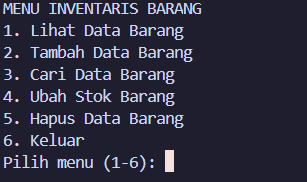
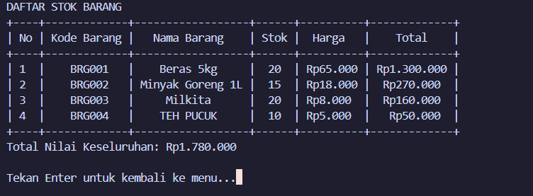
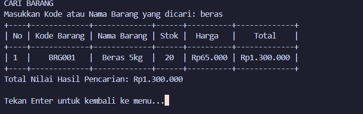
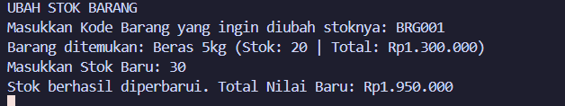
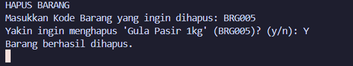

# Studi Kasus 6 - Sistem Manajemen Inventaris Barang

## Biodata Mahasiswa
* **Nama** : M. Fairuz Firerza Aliushami
* **NIM** : 2609116062
* **Kelas** : B

---

## Deskripsi Program
Program ini merupakan aplikasi berbasis konsol (CLI) menggunakan bahasa pemrograman Python untuk mengelola stok barang inventaris toko secara dinamis. Seluruh data disimpan dan disinkronkan secara permanen menggunakan format file JSON (`inventaris.json`). Tampilan data disajikan rapi menggunakan tabel berbasis pustaka `prettytable`.

---

## Fitur Utama Program
1. **Penyimpanan Permanen (JSON)**: Data barang tersimpan otomatis di file `inventaris.json`.
2. **Tampilan Tabel Rapi (PrettyTable)**: Menampilkan seluruh data dengan format tabel kolom yang tertata rapi.
3. **Kode Barang Otomatis**: Kode barang (seperti `BRG001`, `BRG002`, dst.) dibuat secara otomatis tanpa perlu diinput manual oleh pengguna.
4. **Perhitungan Total Nilai Otomatis**: Kolom total langsung mengalikan `Stok * Harga` untuk setiap barang, serta menampilkan total nilai keseluruhan inventaris.
5. **Pencarian Barang**: Memungkinkan pencarian fleksibel berdasarkan nama atau kode barang.
6. **Pembaruan Stok Barang**: Mengubah jumlah stok barang yang sudah terdaftar.
7. **Penghapusan Barang**: Menghapus data barang dengan konfirmasi `(y/n)` agar aman dari kesalahan klik.
8. **Validasi Input Ketat**:
   - Mencegah input angka negatif untuk stok maupun harga.
   - Mencegah input kosong.
   - Menangani error input tipe data (*exception handling* `ValueError`).
9. **Manajemen Konsol Interaktif**: Menggunakan `os.system("cls")` untuk menjaga kebersihan layar terminal dan `sleep` untuk jeda waktu respon yang nyaman.

---

## Dokumentasi & Hasil Pengujian (Screenshots)

Berikut adalah dokumentasi tangkapan layar pengujian fitur-fitur program di terminal:

### 1. Menu Utama
Tampilan awal program berupa menu interaktif (pilihan 1 sampai 6).

---

### 2. Lihat Data Barang (Menu 1)
Menampilkan daftar seluruh barang di dalam tabel PrettyTable, lengkap dengan harga satuan, total nilai per barang (`stok × harga`), dan total nilai keseluruhan inventaris.

---

### 3. Tambah Barang Baru (Menu 2)
Penambahan barang baru di mana kode barang (`BRG...`) digenerate secara otomatis oleh sistem, disertai validasi input dan perhitungan total nilai barang.

---

### 4. Cari Data Barang (Menu 3)
Fitur pencarian barang berdasarkan nama atau kode barang yang menghasilkan tabel data barang yang cocok.

---

### 5. Ubah Stok Barang (Menu 4)
Memperbarui jumlah stok barang yang terdaftar dan secara otomatis menghitung ulang total nilai barang tersebut.

---

### 6. Hapus Data Barang (Menu 5)
Menghapus barang dari daftar inventaris dengan proteksi konfirmasi `(y/n)` sebelum data dihapus.

---

### 7. Keluar Program (Menu 6)
Mengakhiri program dengan tampilan layar bersih dan pesan selesai.

---

## Penjelasan Struktur Kode Program

### 1. Pustaka / Modul yang Digunakan
* `import json`: Digunakan untuk membaca (*load*) dan menyimpan (*dump*) data inventaris ke file `inventaris.json`.
* `import os`: Digunakan untuk memeriksa keberadaan file (`os.path.exists`) dan membersihkan tampilan konsol (`os.system("cls")`).
* `from time import sleep`: Digunakan untuk memberikan jeda beberapa detik setelah proses simpan/ubah/hapus sebelum layar dibersihkan kembali.
* `from prettytable import PrettyTable`: Digunakan untuk membuat visualisasi tabel teks yang rapi dan terstruktur di terminal.

### 2. Penjelasan Fungsi-Fungsi

#### `muat_data()`
Fungsi ini bertugas membaca data dari `inventaris.json`. Jika file belum ada atau terjadi error, fungsi mengembalikan *list* kosong `[]` agar program tetap berjalan tanpa *crash*.

#### `simpan_data(data_inventaris)`
Fungsi ini menyimpan list dictionary data inventaris ke dalam `inventaris.json` dengan format indentasi 4 spasi dan enkoding UTF-8 agar tersimpan rapi dan aman.

#### `generate_kode_barang(data_inventaris)`
Fungsi ini membaca seluruh kode barang yang memiliki awalan `BRG` (misal `BRG001`, `BRG002`), mencari nomor urut terbesar, lalu menghasilkan kode berikutnya (misal `BRG003`, `BRG004`). Hal ini menjamin setiap barang memiliki kode unik secara otomatis.

#### `tampilkan_inventaris(data_inventaris)`
Fungsi ini membersihkan layar lalu membentuk objek `PrettyTable` dengan kolom:
* `No`, `Kode Barang`, `Nama Barang`, `Stok`, `Harga`, dan `Total`.
Kolom `Total` otomatis dihitung dari perkalian `stok * harga`. Di akhir tabel ditampilkan `Total Nilai Keseluruhan`.

#### `tambah_barang(data_inventaris)`
Fungsi ini mengambil kode otomatis dari `generate_kode_barang()`, lalu meminta input nama, stok, dan harga. Terdapat validasi:
* Nama tidak boleh kosong.
* Stok dan harga harus berupa angka bulat dan tidak boleh bernilai negatif (`>= 0`).
Setelah berhasil, data dimasukkan ke dalam list dan disimpan ke file JSON.

#### `cari_barang(data_inventaris)`
Fungsi ini melakukan pencarian kata kunci yang tidak sensitif terhadap huruf besar/kecil (*case-insensitive*) pada kode maupun nama barang, lalu menampilkan hasilnya dalam bentuk tabel PrettyTable.

#### `ubah_stok(data_inventaris)`
Fungsi ini mencari barang berdasarkan kode, lalu meminta input stok baru dengan validasi angka bulat dan non-negatif, kemudian memperbarui total nilai dan menyimpan perubahan.

#### `hapus_barang(data_inventaris)`
Fungsi ini mencari barang berdasarkan kode yang dimasukkan, lalu meminta konfirmasi `y/n` sebelum barang benar-benar dihapus dari list dan file JSON.

#### `main()`
Fungsi utama yang menjalankan perulangan *loop* menu interaktif (1-6). Mengarahkan pilihan pengguna ke fungsi yang sesuai dan menangani validasi menu yang tidak valid.

---
